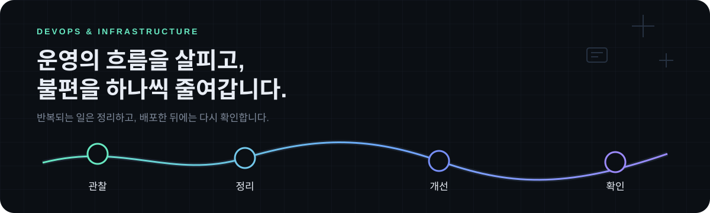

  

  <strong>사람이 매번 신경 써야 했던 일을, 더 단순하고 안전한 흐름으로 바꾸는 걸 좋아합니다.</strong> 
  기능부터 만들기보다, 실제로 누가 어디서 막히고 무엇을 반복하는지 먼저 봅니다.

  
  
  

---

## 🧭 안녕하세요!

요청받은 기능을 바로 만들기 전에, 같은 요청이 왜 계속 생기는지부터 봅니다.  
누가 기다리고, 어디에서 같은 일을 반복하는지 흐름을 따라가며 살펴봅니다.  
먼저 작은 도구로 풀어본 뒤, 실제로 쓰는 사람이 헷갈리지 않는지, 실수가 생겨도 안전하게 대응할 수 있는지까지 챙깁니다.

> 화려한 기능보다, 실제로 쓰는 사람의 일이 조금이라도 단순해지는 결과를 더 중요하게 생각합니다.

## ⚙️ 이렇게 일합니다

- **기능보다 먼저 흐름을 봅니다.** 요청 전후에 어떤 대기와 반복이 생기는지 살펴봅니다.
- **사람이 해야 할 판단은 남겨둡니다.** 모든 걸 자동화하기보다, 반복 작업과 실수하기 쉬운 부분을 도구가 맡게 합니다.
- **잘 되는 경우만 생각하지 않습니다.** 중복 처리, 실패, 복구, 작업 이력처럼 실제 운영에 필요한 안전장치까지 챙깁니다.
- **작게 만들고 실제로 써보며 고칩니다.** 처음부터 크게 만들기보다, 짧은 주기로 확인하고 필요한 만큼 다듬습니다.
- **배포로 끝내지 않습니다.** 실제로 일이 줄었는지, 운영 과정에 새로운 불편이 생기지는 않았는지 확인합니다.

## 🧰 익숙한 도구

  <strong>Backend</strong> 
  
  
  
  

  <strong>Data</strong> 
  
  

  <strong>Web &amp; Mobile</strong> 
  
  
  

  <strong>Quality</strong> 
  

  <strong>DevOps &amp; Infrastructure</strong> 
  
  
  
  
  

  <strong>Observability</strong> 
  
  

## 📈 꾸준히 남기는 기록

  

  <strong>반복되는 일은 도구가 맡고, 사람은 더 중요한 판단에 집중할 수 있도록 돕는 개발을 하고 싶습니다.</strong>

  

